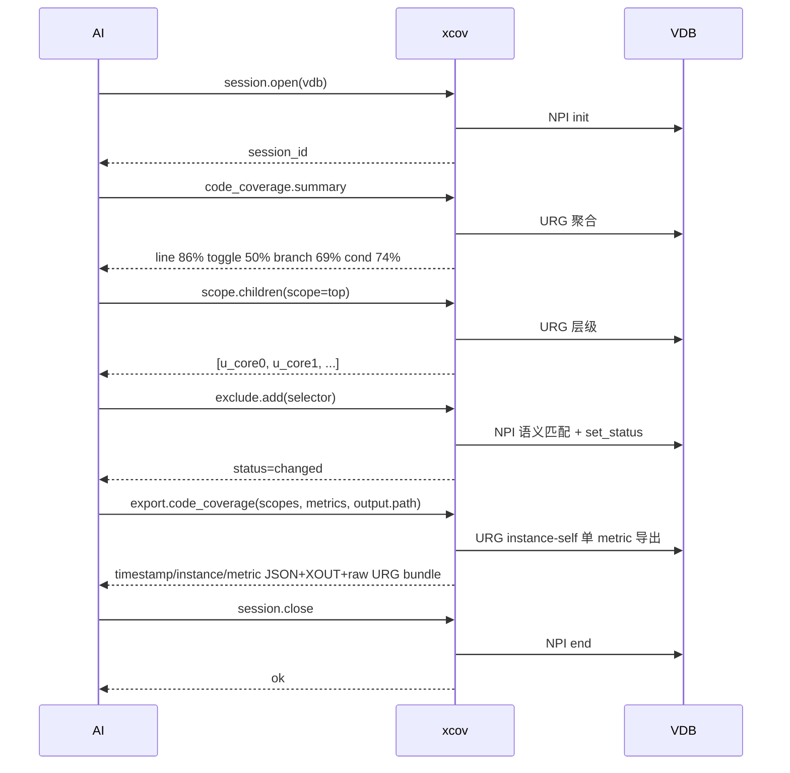

# xcov AI 查询流程

```mermaid
sequenceDiagram
    participant AI
    participant xcov
    participant VDB

    AI->>xcov: session.open(vdb)
    xcov->>VDB: NPI init
    xcov-->>AI: session_id

    AI->>xcov: code_coverage.summary
    xcov->>VDB: URG 聚合
    xcov-->>AI: line 86% toggle 50% branch 69% cond 74%

    AI->>xcov: scope.children(scope=top)
    xcov->>VDB: URG 层级
    xcov-->>AI: [u_core0, u_core1, ...]

    AI->>xcov: exclude.add(selector)
    xcov->>VDB: NPI 语义匹配 + set_status
    xcov-->>AI: status=changed

    AI->>xcov: export.code_coverage(scopes, metrics, output.path)
    xcov->>VDB: URG instance-self 单 metric 导出
    xcov-->>AI: timestamp/instance/metric JSON+XOUT+raw URG bundle

    AI->>xcov: session.close
    xcov->>VDB: NPI end
    xcov-->>AI: ok
```
