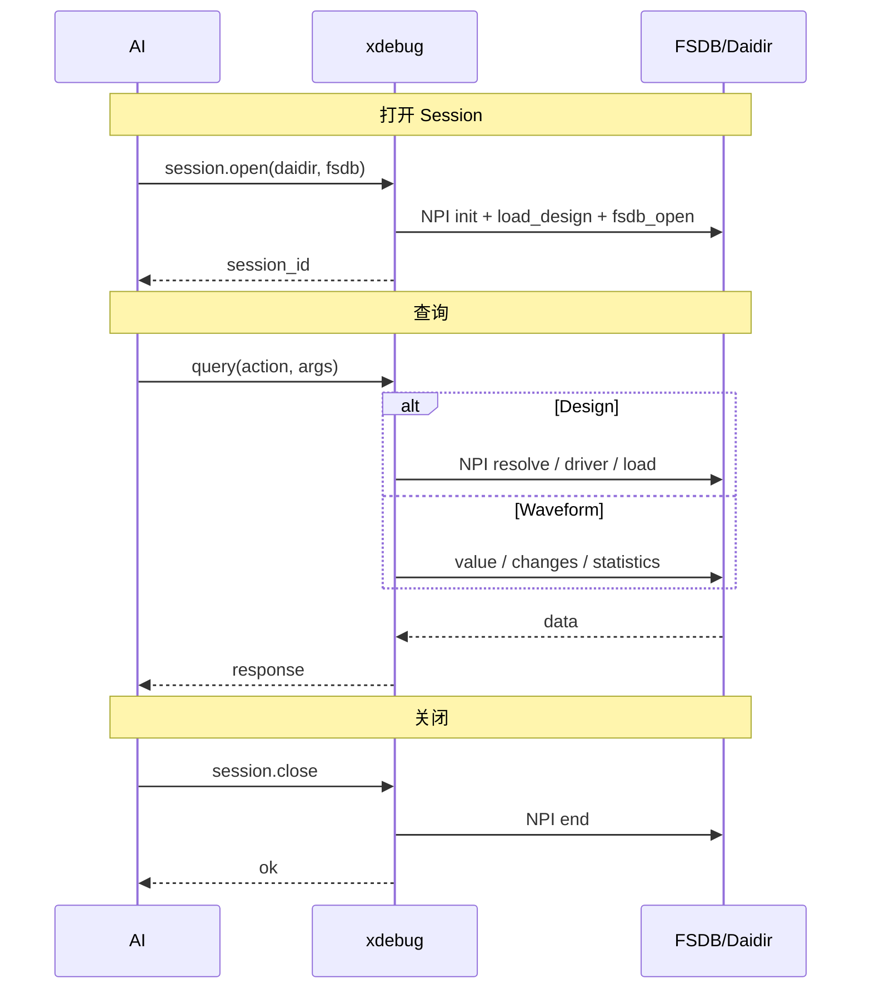

# xdebug 架构与交互流程

```mermaid
sequenceDiagram
    participant AI
    participant xdebug
    participant FSDB as FSDB/Daidir

    Note over AI,FSDB: 打开 Session

    AI->>xdebug: session.open(daidir, fsdb)
    xdebug->>FSDB: NPI init + load_design + fsdb_open
    xdebug-->>AI: session_id

    Note over AI,FSDB: 查询

    AI->>xdebug: query(action, args)

    alt Design
        xdebug->>FSDB: NPI resolve / driver / load
    else Waveform
        xdebug->>FSDB: value / changes / statistics
    end

    FSDB-->>xdebug: data
    xdebug-->>AI: response

    Note over AI,FSDB: 关闭

    AI->>xdebug: session.close
    xdebug->>FSDB: NPI end
    xdebug-->>AI: ok
```
